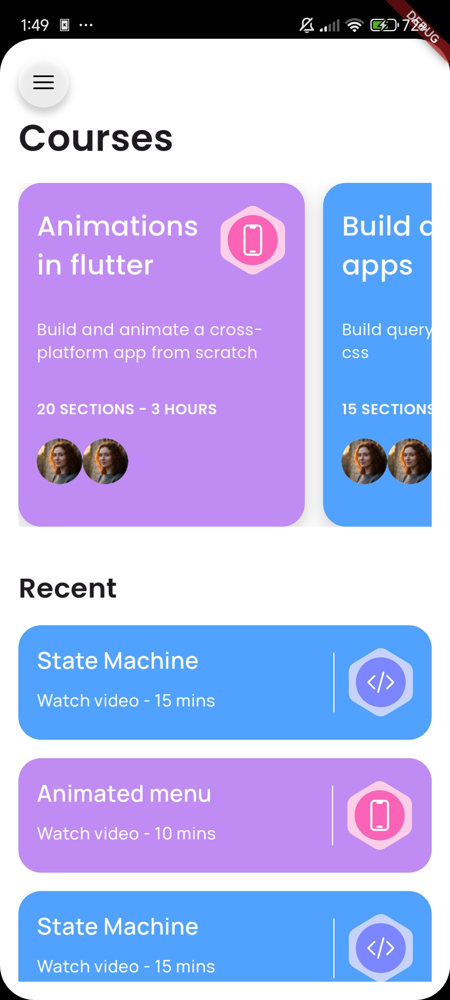
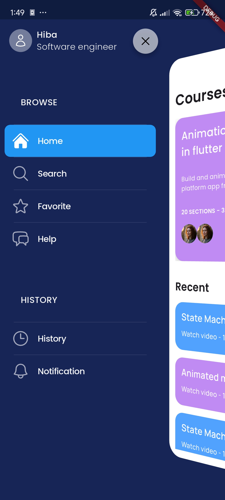
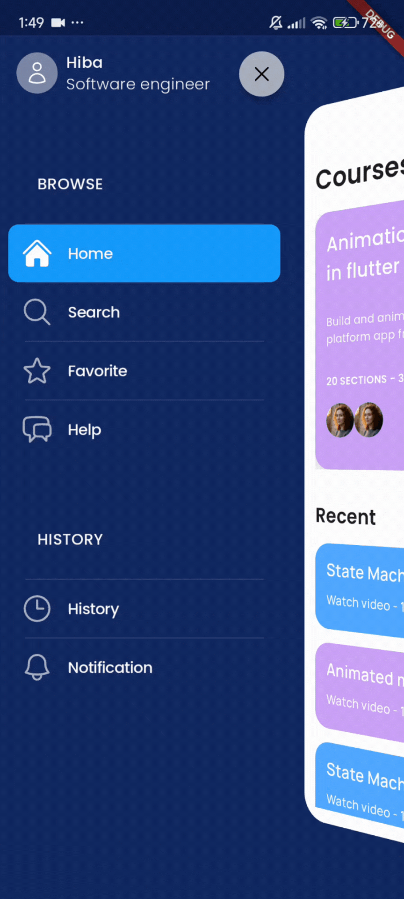

# Plum - Flutter Course App

A Flutter application for browsing and managing courses. This app showcases a clean UI with smooth animations.

## App Preview


<div style="display: flex; gap: 10 px; flex-wrap: wrap;">
  
  
  
  
  
  
</div>

## Features

-   **Home Page:** Displays a list of courses.
-   **Course Page:** Shows details about a selected course.
-   **Animated Drawer:** A custom side menu with animations for selected items.
-   **Custom Fonts:** Integration with Google Fonts for a unique look and feel.

## Getting Started

To get a local copy up and running, follow these simple steps.

### Prerequisites

-   [Flutter SDK](https://flutter.dev/docs/get-started/install)
-   [Dart SDK](https://dart.dev/get-dart)

### Installation

1.  Clone the repo
    ```sh
    git clone <YOUR_REPOSITORY_URL>
    ```
2.  Install packages
    ```sh
    flutter pub get
    ```
3.  Run the app
    ```sh
    flutter run
    ```

## Dependencies

This project uses the following main dependencies:

-   [cupertino_icons](https://pub.dev/packages/cupertino_icons)
-   [google_fonts](https://pub.dev/packages/google_fonts)
-   [flutter_svg](https://pub.dev/packages/flutter_svg)

